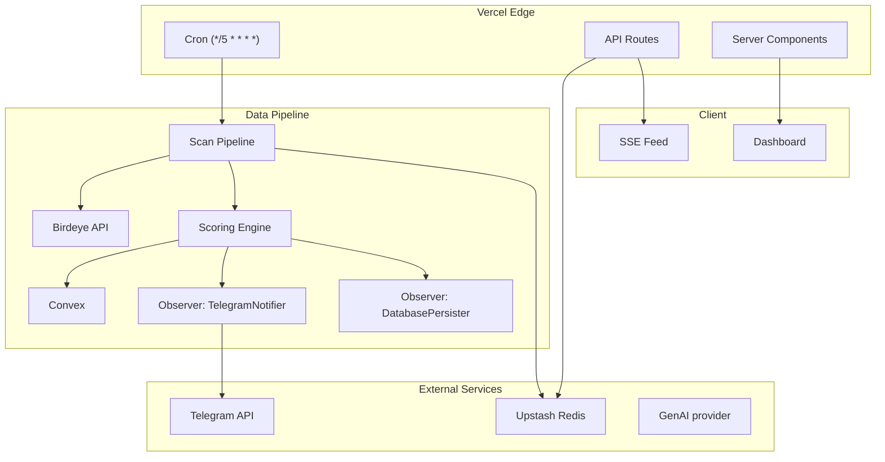

# SENTRY — Implementation Plan

## Overview
Pre-Trade Intelligence Agent for Solana — Birdeye Data BIP Sprint 4

## Execution Order (18 Phases)

| # | Phase | Status |
|---|-------|--------|
| 1 | Convex schema + access rules | 🔄 |
| 2 | TypeScript types (`types/index.ts`) | 🔄 |
| 3 | `lib/cache/redis.ts` — cache foundation | 🔄 |
| 4 | `lib/birdeye/client.ts` — circuit breaker | 🔄 |
| 5 | `lib/birdeye/endpoints.ts` + tests | 🔄 |
| 6 | `lib/scoring/engine.ts` + tests (TDD) | 🔄 |
| 7 | `lib/ratelimit/limiters.ts` + tests | 🔄 |
| 8 | `app/api/scan/route.ts` — core pipeline | 🔄 |
| 9 | `lib/telegram/bot.ts` + `queue.ts` | 🔄 |
| 10 | Components: TokenCard + Skeleton (TDD) | 🔄 |
| 11 | `app/page.tsx` — Server Component dashboard | 🔄 |
| 12 | `app/api/tokens/route.ts` — public endpoint | 🔄 |
| 13 | `next.config.ts` — security headers | 🔄 |
| 14 | Lighthouse audit → fix CLS/LCP | 🔄 |
| 15 | Integration test: full scan pipeline | 🔄 |
| 16 | `vercel.json` cron config | 🔄 |
| 17 | Deploy + verify health endpoint | 🔄 |
| 18 | GitHub README + architecture diagram | 🔄 |

## Architecture

## Design Patterns
- **Strategy** → Scoring (Conservative vs Aggressive)
- **Circuit Breaker** → Birdeye API client
- **Observer** → Scan pipeline event system
- **Repository** → Convex data access
- **Factory** → Rate limiter creation
